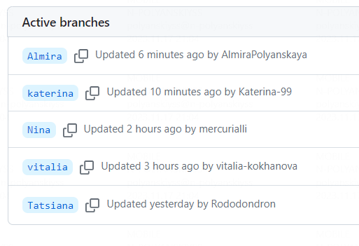

# ANO_Kolokol

<a name="readme-top"></a>

<!-- PROJECT SHIELDS -->
<!--
*** I'm using markdown "reference style" links for readability.
*** Reference links are enclosed in brackets [ ] instead of parentheses ( ).
*** See the bottom of this document for the declaration of the reference variables
*** for contributors-url, forks-url, etc.
*** https://www.markdownguide.org/basic-syntax/#reference-style-links
-->

<!-- PROJECT LOGO -->
<br />
<div align="center">
<a href="https://t.me/kolokol196">

<h3 align="center">"АНО "Колокол"</h3></a>
</div>
<br />

<!-- TABLE OF CONTENTS -->
<details>
  <summary>Содержание</summary>
  <ol>
    <li><a href="#about-the-project">О проекте</a></li>
    <li><a href="#built-with">Инструменты</a></li>
    <li><a href="#usage">Реализация</a></li>
    <li><a href="#contact">Команда</a></li>
    <li><a href="#link">Ссылка</a></li>
  </ol>
</details>

<!-- ABOUT THE PROJECT -->

## О проекте

Данный проект создан для Автономной Некоммерческой Организации "Колокол", занимающейся **возрождением профессии жестянщика** и искусства изготовления **фальцевой кровли.**

Это наш **второй учебный проект по верстке** сайта по макету Figma, и отлчается он от прошлого проекта тем, что на этот раз нам было нужно **создать макет самостоятельно**, поскольку у заказчика его не было.

Итоговый макет, по которому наша команда осуществляла верстку [![Product Name Screen Shot][product-screenshot]](<https://www.figma.com/file/QAB23bTFS78wEAUSo6RAjK/%D0%90%D0%9D%D0%9E-%D0%9A%D0%BE%D0%BB%D0%BE%D0%BA%D0%BE%D0%BB-(2-%D0%B2%D0%B5%D1%80%D1%81%D0%B8%D1%8F)?type=design&node-id=1%3A283&mode=design&t=Jyg0XzNpVhEBb7oh-1](https://www.figma.com/file/QAB23bTFS78wEAUSo6RAjK/%D0%90%D0%9D%D0%9E-%D0%9A%D0%BE%D0%BB%D0%BE%D0%BA%D0%BE%D0%BB-(last-version)?type=design&node-id=1%3A108&mode=design&t=6bJX251JqalI0Ebl-1)> "Макет")

В этом проекте мы сделали базовую верстку сайта шириной 1280px.

_Далее мы планируем добавить адаптивность для экранов разных размеров: телефонов, планшетов, ноутбуков и больших десктопов._

<!-- BUILD WITH -->

## Инструменты

_В этом проекте мы впервые использовали при написании кода препроцессор SASS:_

```
@import "_variables";
@import "_mixins";

.pattern {
  @include flex-center;
  max-width: 1280px;
}
```

```
// Цвет шрифта
$beige: #c8aa86;
$brown: #603c22;
$gray: #59606c;
$light-gray: #c4c4c4;
$light-stroke_color: rgba(45, 48, 56, 0.15);
$dark-stroke_color: rgba(45, 48, 56, 0.5);
$shadow: rgba(0, 0, 0, 0.25);
```

```
.header__menu__list {
  list-style: none;
  @include flex-center;
  flex-wrap: wrap;
  padding-inline-start: 0;

  &__item {
    @include flex-center;
    margin-right: 20px;
    padding: 7px 15px;
    cursor: pointer;

    & a {
      text-align: center;
      color: $gray;
      line-height: 22px;
      text-decoration: none;
      font: {
        size: 20px;
        weight: 600;
      }
    }
  }
}
```

_А также впервые осуществляли процесс верстки сайта в разных ветках GIT_
<br />

<br />

Здесь представлены инструменты, которые мы использовали в работе.


<!-- USAGE -->

## Реализация

Версия экрана 1280px
<br />

<br />

<!-- CONTACT -->

## Команда

_Нам очень понравилось участвоать в создании сайта для этого проекта!_

Альмира - [GitHub](https://github.com/AlmiraPolyanskaya)

Екатерина - [GitHub](https://github.com/Katerina-99)

Виталия - [GitHub](https://github.com/vitalia-kokhanova)

Татьяна - [GitHub](https://github.com/Rododondron)

Нина - [GitHub](https://github.com/mercurialli)

<!-- LINK -->

## Ссылка

Ссылка на проект

Project Link: [https://github.com/AlmiraPolyanskaya/ano_kolokol](https://github.com/AlmiraPolyanskaya/ano_kolokol)

<p align="right">(<a href="#readme-top">back to top</a>)</p>

[product-screenshot]: ./assets/images/git_readme/logo.png

<!-- MARKDOWN LINKS & IMAGES -->
<!-- https://www.markdownguide.org/basic-syntax/#reference-style-links -->

[contributors-shield]: https://img.shields.io/github/contributors/othneildrew/Best-README-Template.svg?style=for-the-badge
[contributors-url]: https://github.com/othneildrew/Best-README-Template/graphs/contributors
[forks-shield]: https://img.shields.io/github/forks/othneildrew/Best-README-Template.svg?style=for-the-badge
[forks-url]: https://github.com/othneildrew/Best-README-Template/network/members
[stars-shield]: https://img.shields.io/github/stars/othneildrew/Best-README-Template.svg?style=for-the-badge
[stars-url]: https://github.com/othneildrew/Best-README-Template/stargazers
[issues-shield]: https://img.shields.io/github/issues/othneildrew/Best-README-Template.svg?style=for-the-badge
[issues-url]: https://github.com/othneildrew/Best-README-Template/issues
[license-shield]: https://img.shields.io/github/license/othneildrew/Best-README-Template.svg?style=for-the-badge
[license-url]: https://github.com/othneildrew/Best-README-Template/blob/master/LICENSE.txt
[linkedin-shield]: https://img.shields.io/badge/-LinkedIn-black.svg?style=for-the-badge&logo=linkedin&colorB=555
[linkedin-url]: https://linkedin.com/in/othneildrew
